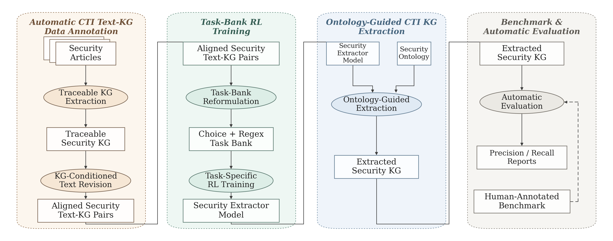
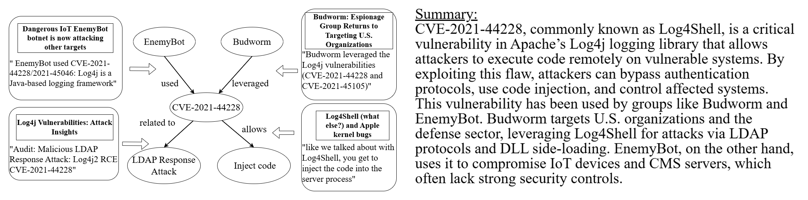

# GRID: Graph Representation of Intelligence Data for Security Text Knowledge Graph Construction

Anonymous artifact for the COLM 2026 submission.

## Overview

GRID is an end-to-end framework for cyber threat intelligence (CTI) article understanding and security knowledge graph construction. This repository is organized around the methodology and empirical results discussed in the paper, including:

- ontology-guided two-step graph extraction
- supervision construction through article-to-graph alignment and KG-conditioned rewriting
- task-bank-based post-training
- unified multi-source benchmark evaluation
- local checkpoints for the principal post-training variants

## Benchmark and Headline Results

The evaluation benchmark contains **249 CTI articles** collected from five sources: `GRID`, `CASIE`, `CTINexus`, `MalKG`, and `SecureNLP`.

| Source | # Articles | Avg. Tokens | Avg. Ground-Truth Edges |
| --- | ---: | ---: | ---: |
| GRID | 49 | 1,102 | 15.35 |
| CASIE | 50 | 537 | 7.94 |
| CTINexus | 50 | 191 | 11.80 |
| MalKG | 50 | 6,632 | 48.90 |
| SecureNLP | 50 | 11,000 | 68.66 |
| Total | 249 | - | - |

Main findings:

- **RQ1.** Task-bank Reward + GRID_Ours inference achieves **84.62%** source-averaged precision, **64.91%** source-averaged recall, and **68.53%** Avg F1.
- **RQ2.** Among the post-training variants, **Task-bank Reward** is the strongest overall model and yields the most favorable effectiveness-cost tradeoff.
- **RQ3.** Both **article rewriting** and **article-complexity-ordered training** contribute to the final system under a shared training budget.

## Method Entry, LLM Judge, and Human Calibration

- The main public GRID two-step entry is `src/grid/GRID_Ours.py`.
- Per-article outputs are also included in the repository artifacts for inspection and reuse.
- The public LLM-judge evaluation entry is `python eval/ultimate_eval_core.py --method GRID_Ours.py --judge_backend kg_reward`.
- `src/tools_prompt_nano.py` records the prompts used by the GRID method (for KG extraction, article rewriting, and multiple-choice question generation) and the reward judge.
- Human calibration artifacts are stored in `eval/llm-judge-calibration-with-human/`, including `reviewer_1.json`, `reviewer_2.json`, and `reviewer_3.json`.
- The paper-reported judge calibration covers 378 manually reviewed audit items from three human reviewers, with 80.6% agreement for precision (154/191), 91.4% agreement for recall (171/187), and 86.0% overall agreement (325/378).

## Repository Structure

- `src/`: `src/grid/` for the main GRID implementation, `src/grid/GRID_Ours.py` for the public two-step entry, `src/comparisons/` for the baseline implementations and shared helpers, plus `tools_nano.py`
- `eval/`: the unified evaluation executor, experiment YAMLs, calibration assets, and `eval/llm-judge-calibration-with-human/` for the three human-review JSON exports
- `generated/`: canonical generated outputs, method registry, and source-level summaries for the representative RQ1 baselines
- `train-data/`: generation code for post-training data and representative parquet artifacts
- `models/`: Hugging Face references for the five checkpoints, model cards, and training summaries
- `benchmark/`: the canonical full-249 runtime input, source-level split views, and schemas
- `result/`: paper-aligned artifacts for RQ1, RQ2, and RQ3

## Evaluation Artifacts

- `generated/registry.csv` indexes the public baseline artifacts included in `generated/<method>/`.
- `generated/<method>/generated/` stores the canonical generated graphs used for the corresponding RQ1 baseline.
- `src/grid/GRID_Ours.py` contains the public GRID two-step method entry used for the main method variant.
- `src/comparisons/Approach_*.py` contains the baseline implementations discussed in RQ1.
- `benchmark/runtime_input/benchmark_full249.parquet` is the canonical five-source benchmark input used by the public evaluation pipeline.
- `benchmark/{casie,ctinexus,grid,malkg,securenlp}/` provides source-level split views for inspection and lightweight reuse.
- For the baseline experiments, the canonical inputs are stored under `benchmark/runtime_input/` and the corresponding generated outputs are stored under `generated/<method>/generated/`.
- `eval/llm-judge-calibration-with-human/` provides the three reviewer JSON exports from the human calibration workbench.

## Checkpoint References

The repository points to the five model variants used in RQ2:

- `models/base_model/`
- `models/task_bank_reward/`
- `models/end2end_reward/`
- `models/choice_only_reward/`
- `models/end2end_sft_without_rl/`

Each directory contains `ref-to-hf-link.txt` with the corresponding Hugging Face location under `anonymousauthorname/ProjectGRID`.

## Figures

Architecture overview:

Example article-to-graph illustration:

## Results

- RQ1: [result/rq1/README.md](result/rq1/README.md), `result/rq1/rq1_main_table.csv`
- RQ2: [result/rq2/README.md](result/rq2/README.md), `result/rq2/post_training_variants.csv`
- RQ3: [result/rq3/README.md](result/rq3/README.md), `result/rq3/ablation_table.csv`

Additional result artifacts:

- method registry and generated artifacts: `generated/registry.csv`, `generated/<method>/artifact_card.json`
- benchmark summary and runtime inputs: `benchmark/source_statistics.csv`, `benchmark/runtime_input/benchmark_full249.parquet`
